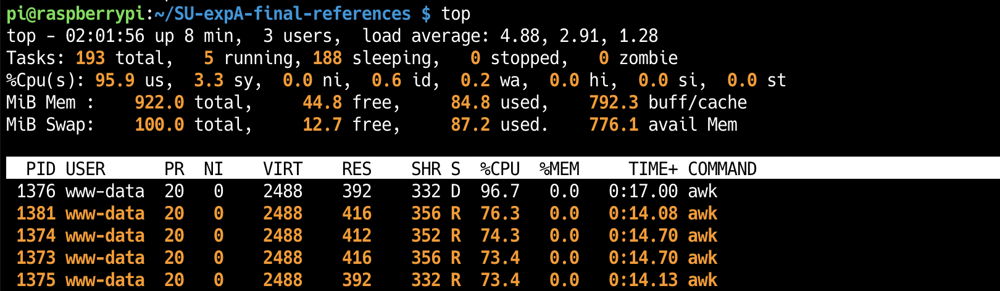

# 高速化に関するヒント

## shell_oneliner.php

awk、パイプ、キャッシュなどを用いて高速化を狙います

### 事前準備

動作にはAPCuが必要です。APCuはインメモリのkey-value ストアです。これを活用すれば、タグをkey、検索結果をvalueとして保存すると次に同じタグのリクエストが来た時に検索を除外するような処理を記述することができます。

動作確認環境: php7.4

```shell
sudo apt install php-apcu php-apcu-bc
# apcu-bcはPHP8.0ではサポート対象外です
```

以下のファイルをエディタで開いて下さい

```shell
vi /etc/php/7.4/mods-available/apcu.ini
```

ファイルを以下のように編集します

```txt
extension=apcu.so
apc.enabled=1
```

phpの設定を適用します

```shell
sudo phpenmod apcu
```

変更反映のため再起動します

```shell
sudo systemctl restart php7.4-fpm
sudo systemctlnvim restart apache2
```

以下のようにapacheのホームディレクトリに`shell_oneliner.php`,`geotag_sort.csv`,`tag.csv`を配置していください。ホームディレクトリについて、記載は`/var/www/html/`としていますが各自の環境に合わせて適時読み替えてください。

`geotag_sort.csv`は`geotag.csv`を時系列順で降順に並び替えたものになります

```txt
/var/www/html/
            ├── php/
            │   └── shell_oneliner.php
            └── csv/
                ├── geotag_sort.csv
                └── tag.csv
```

### さらなる高速化のためのヒント



上記画像はベンチマーク実行時のtopコマンド結果が表示されています。観察すると、スワップ領域の使用率が高いこと、awk使用中のプロセスが4つあることが見て取れると思います。ここから高速化するためにはどう計算資源を管理すれば良いのでしょうか。apacheに関する講義資料などを見直すとなにかヒントになるかもしれません。
